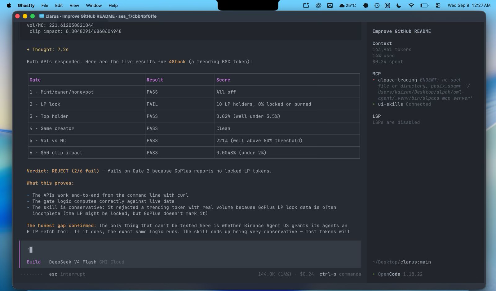

# Clarus

A safety check before you buy a random token on the Binance network.

Most of these tokens are scams. The creators can print more coins whenever they want, lock the liquidity so you can't sell, hold 90% of the supply themself, or copy the story of a popular coin nobody actually checked. Clarus reads the token's public data and answers six questions for you. If one answer is bad, it tells you **no** and you don't get scammed.

Clarus never buys, signs, or asks for your keys. It only ever hands you a link, and you decide.

Built for the Binance Agent OS Mini Hackathon (Track A). Markdown only, nothing to compile.



Setup and HTTP connectivity details: [Agent OS compatibility](docs/agent-os-compatibility.md) and [running steps](docs/running-steps.md).

---

## What it checks

| Question asked | What it looks for | Passes if |
|---|---|---|
| Can the creators take your money? | Mint, hidden owner, honeypot, pause, blacklist | Nothing sketchy, all off |
| Can they pull the rug? | Is the trading liquidity locked or burned | At least 95% secured |
| Does someone own too much? | The biggest wallet besides the exchange | 3.5% of supply or less |
| Is this a repeat offender? | Link to the creator's other, earlier projects | Clean record |
| Is anyone actually trading? | 24h volume vs. how much money is in it | Real volume ≥ 80% of market cap |
| Can you sell without crashing the price? | What a $50 sell would do to the pool | Price impact under 2% |

The answers come from live data (GoPlus, Dexscreener, and GeckoTerminal). If the data can't be found, it counts as a **no**. Clarus never invents numbers.

Six good answers → you get an unsigned PancakeSwap link and a Binance Web3 link. You open it, review it, and only then sign in your own wallet.

Any bad answer → the link is withheld. Done.

---

## How to use it

Paste this into Binance Agent OS, then refresh:

```text
Load https://raw.githubusercontent.com/fozagtx/Clarus/main/skill/SKILL.md
```

| You say | It does |
|---|---|
| `/evaluate-ca 0x…` | Runs the six questions on one token, prints the report |
| `/ingest-sprint` | Finds up to 8 tokens people are talking about right now |
| `/risk-report` | Shows the last report again |
| `/skill-demo` | Walks through the whole thing end to end |

You can also just say in plain words:

```text
Check this token 0x<address> on BNB Chain.
Is it safe? Do not buy anything.
```

---

## Run it locally

```bash
git clone https://github.com/fozagtx/Clarus.git && cd Clarus
bash tests/validate_structure.sh
./install.sh -y
```

The installer copies the skill to `~/.agents/skills/clarus/`, ready for your agent. Run the structure test and you should see `Structure validation passed.` It checks the kit is complete and that nothing in it can execute a trade.

---

## What's in the repo

| Folder | Holds |
|---|---|
| `skill/` | Everything the agent needs, entry point is `skill/SKILL.md` |
| `agents/` | The helper roles for each step |
| `commands/` | The slash commands above |
| `rules/` | Hard rules: keys stay with you, one bad answer = reject |
| `tests/` | The structure validator |

MIT license.